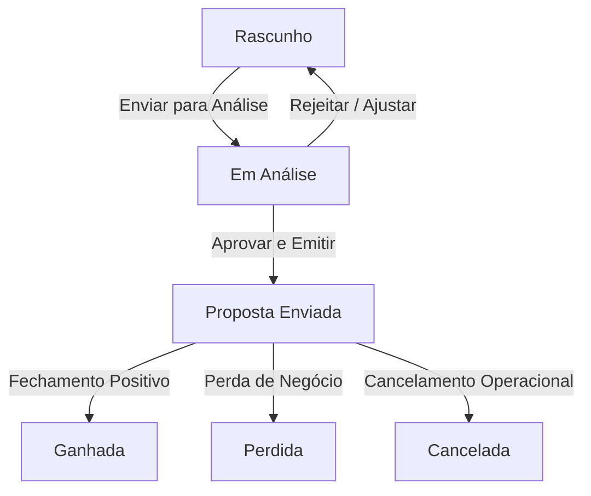

# PRD - Módulo e Tela de Oportunidades (Cerberus)

---

## 1. Visão Geral do Produto

### 1.1. Contexto e Objetivo
O módulo de **Oportunidades** do Cerberus tem como objetivo centralizar o fluxo de negociações comerciais para o mercado **Privado**. Ele serve como o motor de precificação e consolidação de propostas de venda e locação de equipamentos e serviços.

A funcionalidade substitui planilhas offline fragmentadas por um fluxo integrado onde o vendedor pode:
* Cadastrar e gerenciar o cabeçalho comercial de uma oportunidade.
* Realizar uploads de propostas em formato Excel vindas de fornecedores externos.
* Mapear e vincular itens cotados em Excel aos itens da oportunidade (Vínculo 1:1) com criação rápida assistida de produtos e fornecedores.
* Organizar e orçar equipamentos individuais e **Kits de Oportunidade** (agrupamento de produtos com lógicas de locação financeiras avançadas).
* Configurar serviços dinâmicos de Instalação e Manutenção de forma condicional.
* Monitorar e aprovar margens e impostos (PIS/COFINS) derivados automaticamente.

---

## 2. Personas do Usuário

| Persona | Papel | Necessidades Chave |
| :--- | :--- | :--- |
| **Vendedor Comercial** | Cadastra e monta as propostas. | Rapidez ao subir planilhas de fornecedores, flexibilidade na adição de equipamentos/serviços e facilidade de visualizar a margem final. |
| **Gerente de Vendas** | Revisa e aprova propostas. | Visualizar detalhadamente a composição de custos, impostos incidentes e autorizar descontos/alterações de markup. |

---

## 3. Ciclo de Vida da Oportunidade (Status)

A oportunidade transiciona entre diferentes estados operacionais:



### Regras de Transição e Bloqueio:
1. **Edição Restrita (Lock Core Fields)**: Quando a oportunidade está nos status `Proposta Enviada`, `Ganhada`, `Perdida` ou `Cancelada`, todos os campos de precificação, markup, impostos e itens ficam **bloqueados para edição** (somente leitura). Se for necessário alterar, a oportunidade deve retornar para o status `Rascunho` (ação permitida apenas para o Gerente ou sob permissão especial).
2. **Validação para Fechamento**: Uma oportunidade não pode ser movida para `Proposta Enviada` ou `Ganhada` se:
   * Houver itens com custo zerado ou sem fornecedor associado.
   * A margem consolidada estiver abaixo da margem mínima definida pela empresa.
   * Houver itens de orçamento importados por Excel pendentes de vínculo (caso o upload tenha sido executado).

---

## 4. Experiência de Usuário (UX/UI) e Layout

O layout da tela de Oportunidades abandona a abordagem tradicional de telas saturadas e divide a experiência em duas interfaces principais: a **Listagem** e os **Detalhes Master-Detail** com abas dinâmicas.

### 4.1. Tela de Listagem (`OpportunityList`)
* **KPI Cards (Top)**:
  * Valor Total sob Negociação (R$)
  * Margem Média Consolidada (%)
  * Quantidade de Oportunidades Ativas
  * Distribuição gráfica simples por status.
* **Filtros Avançados**: Busca por Cliente (Autocomplete), Vendedor responsável, Status da Oportunidade, Período de Fechamento Esperado e Empresa Raiz.
* **Tabela de Dados**: Exibe ID, Título, Cliente, Valor Total, Margem Consolidada, Vendedor, Status (com badge de cor correspondente) e Ações (Editar, Duplicar, Soft-Delete).

### 4.2. Tela de Detalhes da Oportunidade (`OpportunityDetails`)
O cabeçalho é fixo no topo, exibindo informações macro de saúde financeira da negociação. Abaixo dele, a navegação é controlada por abas dinâmicas que aparecem ou desaparecem conforme seleções lógicas do usuário.

#### 4.2.1. Bloco de Cabeçalho Fixo (Painel de Métricas)
* **Status Badge**: Localizado no topo direito.
* **KPIs em Tempo Real**:
  * **Valor de Venda Total**: R$ XX.XXX,XX
  * **Custo Total Consolidado**: R$ XX.XXX,XX
  * **Margem Consolidada**: XX,XX% (com cor dinâmica: Verde se >= margem alvo, Laranja se estiver perto do limite, Vermelho se estiver abaixo do mínimo).
* **Seletores Booleanos de Escopo**:
  * `[ ] Possui Venda` (Habilita aba Equipamentos/Kits)
  * `[ ] Possui Locação` (Habilita aba Parâmetros de Locação)
  * `[ ] Possui Instalação` (Habilita aba Instalação)
  * `[ ] Possui Manutenção` (Habilita aba Manutenção)

```text
+------------------------------------------------------------------------------------+
| ID: #OP-2026-0089  |  Cliente: Acme Corp.  |  Status: [Rascunho]                   |
| Custo Total: R$ 50.000,00 | Venda Total: R$ 85.000,00 | Margem: [  41.1%  ]            |
|                                                                                    |
| Escopos: [x] Possui Venda  [ ] Possui Locação  [x] Possui Instalação  [ ] Possui Maint|
+------------------------------------------------------------------------------------+
| [Dados Gerais]  |  [Parâmetros]  |  [Equipamentos]  |  [Orçamentos]  |  [Instalação] |
+------------------------------------------------------------------------------------+
```

---

## 5. Especificação Detalhada das Abas

### Aba 1: Dados Gerais
* **Objetivo**: Informações cadastrais e cronograma da oportunidade.
* **Campos**:
  * **Nome/Título da Oportunidade** (Texto livre, Obrigatório)
  * **Cliente** (Autocomplete apontando para o cadastro de Empresas de tipo `CLIENTE`, com exibição do CNPJ formatado)
  * **Empresa Raiz** (Empresa emissora da nota - derivação automática do cadastro do usuário logado)
  * **Vendedor Responsável** (Autocomplete de Usuários)
  * **Data Estimada de Fechamento** (Datepicker)
  * **Probabilidade de Fechamento** (Select: 10%, 30%, 50%, 70%, 90%)
  * **Observações Gerais** (Rich Text Area)

---

### Aba 2: Parâmetros Financeiros & Fiscais
Esta aba centraliza as regras de markup e impostos incidentes sobre a venda ou locação.

* **Regra Tributária Automática**: Ao selecionar o Cliente e a Empresa Raiz na Aba 1, a API deve consultar os parâmetros tributários cadastrados e preencher automaticamente as alíquotas de:
  * **PIS (%)** e **COFINS (%)**
  * Caso não exista cadastro prévio, o sistema herda valores padrão configurados na Empresa Raiz.
* **Markup e Margem Alvo**:
  * Campo para definição do **Markup Desejado (%)** ou **Margem de Contribuição Alvo (%)**. A alteração de um recalcula o outro em tempo real no frontend.
* **Parâmetros de Locação** (Ativo se `Possui Locação = true`):
  * **Prazo do Contrato (Meses)** (Inteiro: ex. 12, 24, 36, 48, 60)
  * **Taxa de Juros Mensal (%)** (Float)
  * **Fator de Margem de Locação (%)** (Markup sobre a parcela mensal)
  * **Custo Operacional Mensal do Kit/Equipamento (R$)** (Valor estimado de manutenção interna do ativo)

---

### Aba 3: Equipamentos, Itens e Kits
Grid de precificação direta dos produtos físicos.

* **Entrada de Dados (Autocomplete de Produto)**:
  * O usuário busca por código ou nome do produto.
  * O sistema consome o **Custo Final Consolidado** cadastrado no MDM do Produto.
  * **Descrição Manual**: O vendedor pode digitar uma descrição livre para um item inexistente, informando o Custo Unitário manualmente (gera um alerta de "Produto Não Homologado").
* **Estrutura de KITS (Visualização em Árvore)**:
  * O usuário pode adicionar um **Kit de Oportunidade** inteiro (previamente cadastrado ou montado na hora).
  * O Kit é renderizado no Grid com uma seta de expansão (collapsible).
  * Os itens componentes do Kit aparecem identados logo abaixo do nó pai.
  * **Regra de Negócio Fiscais do Kit**: O Kit em si não calcula impostos individuais. Ele consolida o custo total dos itens filhos. Os impostos e a depreciação são calculados no nó pai do Kit baseados no contrato.
* **Cálculo de Preço de Locação do Kit**:
  A fórmula matemática executada no backend (e simulada no frontend) é:
  $$CustoAquisicaoKit = \sum(CustoBaseUnitarioItem \times Qtd)$$
  $$DepreciacaoMensal = \frac{CustoAquisicaoKit}{PrazoContrato}$$
  $$CustoTotalMensal = DepreciacaoMensal + CustoOperacionalMensal$$
  $$TaxaLocacao = \frac{Juros}{1 - (1 + Juros)^{-PrazoContrato}}$$
  $$PrecoBaseMensal = CustoAquisicaoKit \times TaxaLocacao$$
  $$PrecoVendaMensal = PrecoBaseMensal \times (1 + FatorMargemLocacao)$$

---

### Aba 4: Orçamentos de Fornecedores (Upload & Mapeamento 1:1)
O coração do módulo comercial. Permite receber cotações complexas de fornecedores externos via planilha Excel e vinculá-las à oportunidade.

```text
+-------------------------------------------------------------------------------+
|  1. UPLOAD DA PLANILHA EXCEL                                                  |
|  [ Download Modelo Template ]   [ Arraste ou Selecione o Arquivo .xlsx ]      |
+-------------------------------------------------------------------------------+
|  2. MAPEAMENTO DE ITENS (Vínculo 1:1)                                         |
|                                                                               |
|  Item Planilha Fornecedor              Vínculo Oportunidade                   |
|  [01] Câmera Bullet IP Intelbras  -->  [ Câmera Intelbras VIP 1230 - Ativo ]  |
|  [02] Cabo Coaxial RG6 95%        -->  [ Criar Produto Novo Inline + ]        |
|  [03] NVR 8 Canais Hikvision      -->  [ NVR Hikvision DS-7608 - Ativo  ]  |
+-------------------------------------------------------------------------------+
```

* **UX de Upload**:
  * Área de Drag & Drop simples para arquivos `.xlsx` ou `.xls`.
  * Botão visível para baixar a planilha modelo (Template Padrão Cerberus).
* **Processador de Importação (Parser)**:
  * A API recebe o arquivo, valida as colunas obrigatórias (Descrição, Quantidade, Valor Unitário, CNPJ do Fornecedor).
  * Se o CNPJ do fornecedor na planilha não estiver cadastrado, abre um modal inline simplificado pré-preenchido usando a API ReceitaWS/cnpj_public para registro rápido do Fornecedor sem interromper o fluxo de importação.
* **Interface de Vínculo 1:1**:
  * Lista no painel esquerdo os itens extraídos do Excel do Fornecedor.
  * Lista no painel direito uma caixa de seleção inteligente (ou interface de arrastar e soltar) contendo os Equipamentos cadastrados na **Aba 3**.
  * **Regras de Negócio de Mapeamento**:
    * Cada item importado do Excel deve ser casado com um item da Oportunidade (Vínculo 1:1).
    * Um item da oportunidade já vinculado fica bloqueado para novas seleções, evitando duplicidade de custos.
    * **Criação Rápida de Produto**: Se o item cotado pelo fornecedor não existir no cadastro de produtos do sistema, o usuário clica em `[+] Criar Produto Novo` no próprio grid. Um popup solicita apenas a Categoria, NCM e Unidade de Medida, inserindo o produto no banco de dados e concluindo o vínculo automaticamente.

---

### Aba 5: Instalação & Aba 6: Manutenção
Abas destinadas à venda de serviços atrelados aos equipamentos.

* **Regra de Filtro de Produtos**:
  * O autocomplete destas abas é restrito rigorosamente a produtos configurados no cadastro principal (MDM) com o atributo `tipo = SERVICO`. Produtos do tipo `EQUIPAMENTO` ou `INSUMO` são ocultados.
* **Parâmetros de Serviços**:
  * Quantidade de horas estimadas (Técnico / Engenheiro).
  * Valor de deslocamento, diárias e hospedagem (Custos Operacionais de Viagem).
  * Margem de contribuição exclusiva aplicada sobre serviços.

---

## 6. Regras de Negócio Críticas (Resumo de Validações)

1. **Soft-Delete**: Oportunidades excluídas devem manter integridade referencial. Elas são marcadas com `deleted_at = datetime` e ocultadas das listagens gerais, mas seus históricos de cotações associadas e produtos não são deletados fisicamente do banco de dados.
2. **Cálculo Tributário por Cascata**:
   * O PIS/COFINS deve ser calculado por dentro do preço de venda final baseado nas configurações fiscais do cliente.
   * Fórmula de Venda Final:
     $$PrecoVendaLiquido = CustoTotal \times (1 + MargemDesejada)$$
     $$PrecoVendaBruto = \frac{PrecoVendaLiquido}{1 - (PIS + COFINS)}$$
3. **Consistência de Estado do SQLAlchemy**:
   * Durante atualizações e reimportações de planilhas Excel, os itens anteriormente associados na relação cascade do SQLAlchemy devem ser atualizados em lote utilizando a consistência da sessão (`db_budget.items.clear()`, adicionando em seguida os novos registros via ORM), prevenindo erros de concorrência ou registros órfãos que disparem o status HTTP 500 do servidor.

---

## 7. Requisitos Não-Funcionais e PWA

* **Detecção de Conectividade**: Caso a conexão caia, a tela de Oportunidades exibe um banner flutuante discreto no topo indicando `"Você está offline. Alterações serão salvas localmente"`.
* **Fila de Sincronização (Offline Queue)**: O sistema armazena as edições de rascunhos no IndexDB do navegador por meio da camada `offline-queue.service.ts`. Quando o sinal retorna, a sincronização roda em background com resolução de conflitos simples (Last Write Wins).
* **Performance**: A tela deve carregar mais de 200 itens mapeados sem apresentar travamento de renderização no React (usar virtualização de lista se necessário).

---

## 8. Planejamento de Implementação e Especialistas

Para guiar a execução técnica deste PRD, recomenda-se a seguinte divisão de trabalho entre os agentes da equipe:

1. **Fase de Banco de Dados e Modelagem (P0)**:
   * **Agente**: `@[database-architect]`
   * **Skill**: `database-design`
   * **Tarefa**: Criação das tabelas de cabeçalho, parâmetros, itens, kits e orçamentos com chaves estrangeiras apropriadas e soft-delete.
2. **Fase de Motor de Cálculo e Importação XLSX (P1)**:
   * **Agente**: `@[backend-specialist]`
   * **Skill**: `api-patterns`
   * **Tarefa**: Criação do serviço Python para processar planilhas Excel multipart com OpenPyXL, resolução de CNPJ e endpoints REST de recalculação.
3. **Fase de Interface Gráfica, Grid e Abas Dinâmicas (P2)**:
   * **Agente**: `@[frontend-specialist]`
   * **Skill**: `react-best-practices`
   * **Tarefa**: Desenvolvimento da UI baseada em abas dinâmicas, modal de lupa de produtos, grid de vinculação drag & drop e sincronismo do PWA com o PWAManager.
